# Por que do ponto a linha?

Entender a regressão aos "pedaços" funciona, mas há limites. Aqui, reúno algumas "peças" de como a regressão linear funciona. Assim, um entendimento um pouco mais amplo dos cálculos que dão origem à regressão linear é exposto. A ideia é ir do plot dos pontos até as linhas de regressão e de intervalos de confiança. Isso pode servir como base para entender não só o funcionamento como também os usos e as limitações.

A intenção é apenas uma: entender de onde "surgem" as "coisas" em uma regressão linear simples. O aprofundamento foi até o limite do que meu conhecimento permitiu. E, como não sou matemático nem parente próximo, por enquanto assuntos mais complexos e fundamentais do cálculo e da álgebra ficarão de lado.

# A regressão linear

A regressão linear é utilizada para quantificar e inferir a relação entre uma variável dependente e uma ou mais variáveis independentes. O princípio básico da regressão pode ser representado por:

$$
y = f(x)
$${#eq-funcao}


Basicamente, o que se busca na regressão é encontrar uma reta em que o valor dos resíduos seja o menor possível. A função que descreve isso é dada como:

$$
\min_{\beta_0,\beta_1} \sum_{i=1}^{n} (y_i-(\beta_0-\beta_1x_i))^2
$${#eq-emq}


Onde os termos $\min_{\beta_0,\beta_1}$ dizem respeito a encontrar valores de $\beta$ que minimizem a função; por minimizar entende-se retornar o menor valor da função. Já $\sum_{i=1}^{n}$ é basicamente somar o resultado de cada operação dos $()$. E, dentro dos $()$, temos a operação que é o valor observado dado por $y_i$ menos o $y$ estimado pelos $\beta_0;~\beta_1x_i$. Eleva-se ao quadrado para trabalhar com os valores negativos e por questões mais aprofundadas de derivada.

Ao fim, queremos os valores de $\beta$ que levem à menor diferença entre o $y$ estimado e o $y$ observado.

<!-- Ou seja, uma função que a partir de $x$ eu obtenha os valores de $y$. Essa notação por si só já é interessante. Como posso manipular $x$ de tal forma que eu encontre $y$? Isso é fantástico. O ponto importante é que essa função precisa existir e, para além disso, eu preciso ser capaz de encontrá-la e "validá-la". -->

::: {#wrn-exp .callout-note collapse="true" title="Finalidade da regressão"}

Um ponto muito importante aqui é dizer que a regressão pode ser utilizada para: descrever, explicar ou predizer dados. E isso é apenas uma questão de narrativa ou objetivo da análise, dependendo puramente de quem a interpreta ou publica (@kasza, @shmueli, @altay).

:::

O modelo matemático da regressão linear pode ser expresso como:

$$
y = \beta_{0} + \beta_{1} x + \epsilon 
$${#eq-regline}

Além disso, é importante que os erros possuam uma distribuição normal com média zero e variância constante.

$$
\epsilon \sim N(0,\sigma^2)
$${#eq-erros}

No entanto, o modelo acima parte do pressuposto de que vamos encontrar os verdadeiros e pontuais valores para os $\beta$s, o que não é necessariamente verdade. Na realidade, o que realizamos na maior parte dos casos é encontrar os valores dos $\beta$s de uma amostra que, em teoria, deve ser uma representação da população (faça uma boa amostragem!). Com isso, o que encontramos na análise são valores médios para os $\beta$s que, dentro de intervalos de confiança, são encontrados como os verdadeiros valores na população. Sendo assim, a equação que utilizamos deve ser:

$$
\hat{y} = \hat{\beta_{0}} + \hat{\beta_{1}}x + \epsilon 
$${#eq-regestimada}


Uma definição mais simples é realizada na seção abaixo.

## Nomenclaturas

É importante definir alguns símbolos que denotam um significado distinto às variáveis, às estimativas dessas e ao modelo de regressão.

- O $y$ é a variável dependente ou resposta;

- O $\hat{y}$ é o valor da estimativa/predição;

- O $y_{i}$ indica o valor observado da observação $i$, onde $i$ assume valores diferentes para cada observação do conjunto de dados;

- O $\bar{y}$ é a média dos valores de $y$ da amostra;

- O $x$ é a variável independente ou explicativa/preditora. Podemos ter mais de um $x$ e poderíamos denotá-los como: $x_{1}, x_{2}, ..., x_{n}$. Como a ideia é focar na regressão simples, apenas um $x$ será usado;

- O $x_{i}$ indica o valor de $x$ da observação $i$, onde $i$ assume valores diferentes para cada observação do conjunto de dados;

- O $\bar{x}$ é a média dos valores de $x$ da amostra;

- $f(x)$ é o modelo, ou seja, a função de $x$;

- $\epsilon$ é o erro do modelo (diferença entre o $y$ previsto e o observado);

- $\epsilon_{i}$ é o erro para cada observação;

- $\beta_{0}$ é o intercepto do modelo (ponto em $y$ onde a reta passa quando $x$ assume valor $0$). Caso a relação do modelo exista na realidade, o $\beta_{0}$ é o valor real da população;

- $\hat{\beta_{0}}$ é o intercepto estimado da amostra;

- $\beta_{1}$ é o coeficiente angular do modelo (variação em $y$ com o aumento de uma unidade em $x$). Caso a relação do modelo exista na realidade, o $\beta_{1}$ é o valor real da população;

- $\hat{\beta_{1}}$ é o coeficiente angular estimado da amostra;

# Desenvolvendo a regressão linear 

## Dados e a pergunta

Para desvendar os mistérios dessa tal regressão linear simples, vamos utilizar os dados de exemplo da @tbl-teste. São apenas 6 linhas de dados, o que é bem pouco; porém, a ideia central é desenvolver a conta e, para facilitar isso, faz-se necessário um exemplo com poucos dados. Nesses dados, imaginamos que temos como variável $x$ a idade de diferentes pessoas e em $y$ a altura de cada uma em cm.

```{r}
#| label: tbl-teste
#| tbl-cap: Dados para a regressão

library(tidyverse)
library(gt)

dados <- data.frame(
  x = c(5, 7, 9, 11, 13, 15),
  y = c(110, 120, 120, 135, 155, 168)
)


dados |>
  gt() |>
  cols_label(
    x = html("x - Idade (anos) <br> (Variável independente)"),
    y = html("y - Altura (cm) <br> (Variável dependente)"),
  ) |>
  tab_header(
    title = "Dados de exemplo"
  ) |>
  cols_align(align = "center") -> table1

table1
```

O primeiro passo é se perguntar: **A idade das pessoas tem efeito na altura?**

Essa pergunta, para ser respondida por meio da regressão, deve ser expressa em termos da equação como: 
$$
Altura = \beta_{0} + \beta_{1} Idade + \epsilon
$${#eq-regdados}


::: {#wrn-exp .callout-note collapse="true" title="Para experimentos"}

Vale lembrar que em um experimento a pergunta é feita antes da análise e que o delineamento do experimento vai refletir a análise a ser utilizada.

:::

Como temos apenas uma variável $x$, podemos criar um gráfico traçando a interseção entre o eixo das abscissas ou $x$ e o eixo das ordenadas ou $y$ $(x;y)$ (@fig-dispersao) e verificar como os dados estão dispersos.

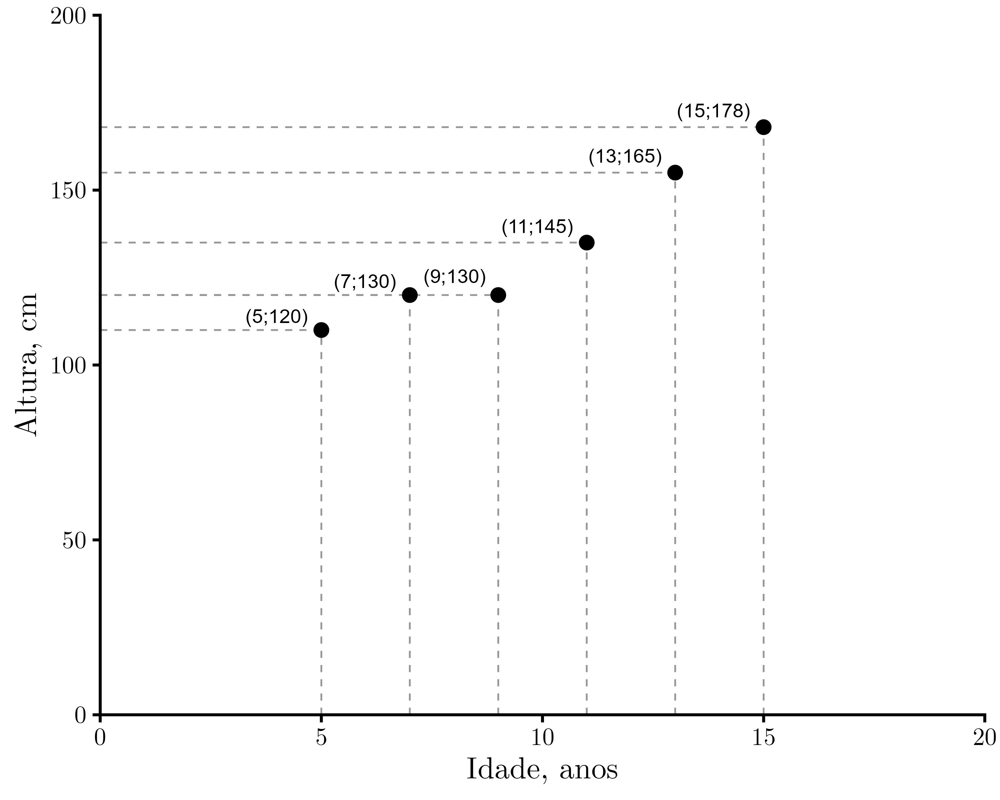{#fig-dispersao}

O que podemos analisar é que parece existir uma relação entre a idade e a altura. Parece que as pessoas mais velhas também são mais altas, pelo menos nessa amostra. Esse é um primeiro indício de que podemos fazer uma regressão com esses dados.

## Estimando os $\beta$s

Para estimar o $\beta_1$ utilizamos a @eq-beta1:

$$
\hat{\beta_{1}} = \frac{\sum(x_{i}-\bar{x})(y_{i}-\bar{y})}{\sum(x_{i}-\bar{x})^2}
$$ {#eq-beta1}

Aqui, observamos que no numerador temos o somatório do produto entre os desvios de $x$ e de $y$. A ideia é verificar o quanto os valores observados estão distantes da média, para cada eixo, e depois multiplicar essas distâncias para observar se a relação é positiva ou negativa. Assim, obtém-se se a relação é de crescimento ou de decrescimento. Ao fim, soma-se tudo, pois o objetivo é usar todos os dados para obter uma única reta. Já no denominador temos os desvios de $x$ ao quadrado, o que serve para verificar o quanto $x$ varia de forma isolada. A divisão é como se tivéssemos o quanto $x$ e $y$ variam juntos dividido pelo quanto $x$ varia sozinho. Ao fim, o resultado é o quanto $y$ muda para cada unidade de mudança em $x$.

Já para o $\beta_0$ é muito mais simples: basta isolá-lo e substituir o $\beta_1$ encontrado pela @eq-beta1 em @eq-beta0:

$$
\hat{\beta_{0}} = \bar{y} - \hat{\beta_{1}}  \bar{x}
$${#eq-beta0}

Mas também podemos encontrar o $\beta_0$ por meio da @eq-beta02.

$$
\hat{\beta}_0 =
\frac{
\sum y_i \sum x_i^2 -
\sum x_i \sum x_i y_i
}{
n \sum x_i^2 -
(\sum x_i)^2
}
$${#eq-beta02}

No numerador temos o somatório dos valores observados de $y$ ($\sum y_i$) multiplicado pelo somatório do quadrado dos valores observados de $x$ ($\sum x_i^2$), tudo isso menos o somatório dos valores observados de $x$ ($\sum x_i$) multiplicado pela soma dos produtos de $x$ e $y$ ($\sum x_i y_i$). Já no denominador temos o número de observações ($n$) multiplicado pelo somatório das observações de $x$ ao quadrado ($\sum x_i^2$) menos o quadrado da soma de $x$ ($(\sum x_i)^2$). A ideia aqui é explicar quanto da altura da reta não se deve à inclinação ($\hat{\beta_1}$).

## Estimando os betas do problema

A ideia é encontrar quais os melhores valores para $\hat{\beta_{0}}$ e para $\hat{\beta_{1}}$ com o menor erro possível. Para isso será utilizada a @eq-beta1 e a @eq-beta0.

Primeiro, calcula-se a média de $x$ e de $y$:


::: {.columns}

::: {.column width="20%"}

$$\bar{x} = \frac{\sum x_i}{n}$$

$$\bar{y} = \frac{\sum y_i}{n}$$

:::

::: {.column width="80%"}

$$
\bar{x} = \frac{5+7+9+11+13+15}{6} = 10
$$ {#eq-mediax}

$$
\bar{y} = \frac{110+120+120+135+155+168}{6} = 134.67
$$ {#eq-mediay}

:::

:::

Depois, iniciamos o cálculo do $\hat{\beta_1}$, e o primeiro passo é fazer a soma do produto dos desvios de cada observação em relação à média de $x$ e de $y$. Graficamente podemos observar o que está sendo realizado, conforme a @fig-mediamedia.

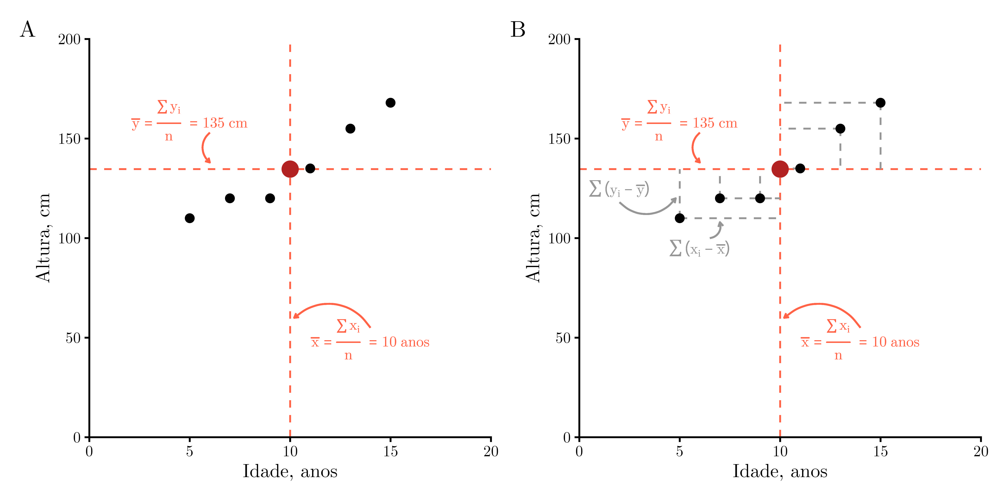{#fig-mediamedia}

O numerador para o $\hat{\beta_1}$ tem o valor de $410$ e foi encontrado da seguinte forma:

$$
\begin{aligned}
\sum(x_{i}-\bar{x})(y_{i}-\bar{y}) =\;&
(5-10)*(110-134.67) + (7-10)*(120-134.67) + {} \\
&
(9-10)*(120-134.67) + (11-10)*(135-134.67) + {} \\
&
(13-10)*(155-134.67) + (15-10)*(168-134.67)
\end{aligned}
$$

$$
\sum(x_{i}-\bar{x})(y_{i}-\bar{y}) = 123.33+44+16.67+0.33+61+166.67= 410
$$

Já para o denominador temos um valor de $70$, encontrado com base no seguinte cálculo:

$$
\begin{aligned}
\sum(x_i - \bar{x})^2 = \;& (5 - 10)^2 + (7-10)^2 + (9-10)^2 + {} \\
&
(11-10)^2 + (13-10)^2 + (15-10)^2
\end{aligned}
$$

$$
\sum(x_i - \bar{x})^2 = 25+9+1+1+9+25 = 70
$${#eq-somadesviox}

Agora, para encontrar o $\beta_1$, basta fazer a divisão, que resulta em 5.86.

$$\hat{\beta_1} = \frac{410}{70} = 5.86$$

Para o $\beta_0$ é só fazer a substituição na equação de regressão (@eq-beta0) e obtemos o valor de 76.10.

$$
\hat{\beta_{0}} = 134.67 - 5.86 * 10 = 76.10
$$

## Modelo final

Agora podemos descrever a equação completa (@eq-regline) como:

$$
\hat{y} = 76.10 + 5.86x
$${#eq-regfinal}

E, graficamente, como na @fig-dispreg, onde observamos o modelo e a equação que descreve a relação entre idade e altura para esses dados simulados. Um outro detalhe importante é que a regressão linear pelo método dos mínimos quadrados obrigatoriamente passará pela média de $x$ e de $y$, o que também observamos na @fig-dispreg no cruzamento das linhas tracejadas.

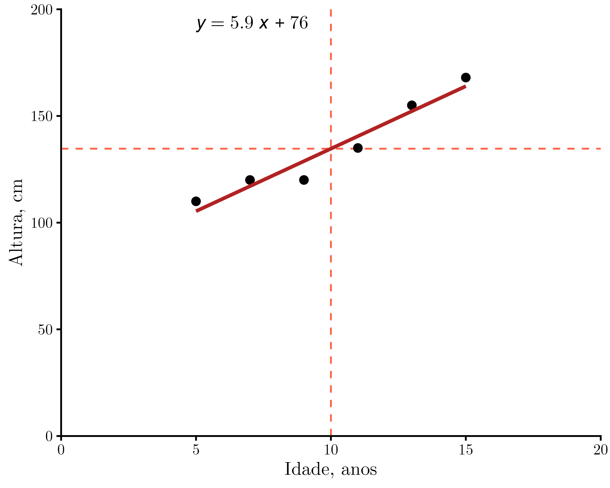{#fig-dispreg}

Ainda nos falta calcular se o modelo serve para algo, o $R^2$, os intervalos de confiança dos coeficientes e a significância dos betas, além de interpretar o modelo. 

::: {#wrn-exp .callout-note collapse="true" title="Pressupostos"}

A análise de regressão possui pressupostos fortes que não devem ser ignorados. Por uma questão de objetivo, não realizarei a análise dos resíduos ou a verificação dos pressupostos.

:::

## Análise de variância da regressão

Uma forma muito interessante de verificar se o modelo é útil é por meio da análise das variâncias. Interprete "útil" como um modelo que consegue explicar parte da variabilidade dos dados de forma superior a um modelo nulo, que utiliza apenas a média. 

Para chegar a isso, podemos descrever a diferença entre os valores observados e a média como: a diferença entre o valor estimado e a média mais a diferença entre o valor observado e o estimado (@eq-desvios).

$$
y_i - \bar{y}
=
(\hat{y}_i - \bar{y})
+
(y_i - \hat{y}_i)
$${#eq-desvios}

Em outras palavras, o primeiro componente após a igualdade na equação se refere ao modelo e ao quanto suas estimativas estão distantes do valor médio. Já a segunda parte diz respeito ao erro ou resíduo, que é o quanto da explicação não foi capturado pelo modelo (@fig-errosdomodelo).


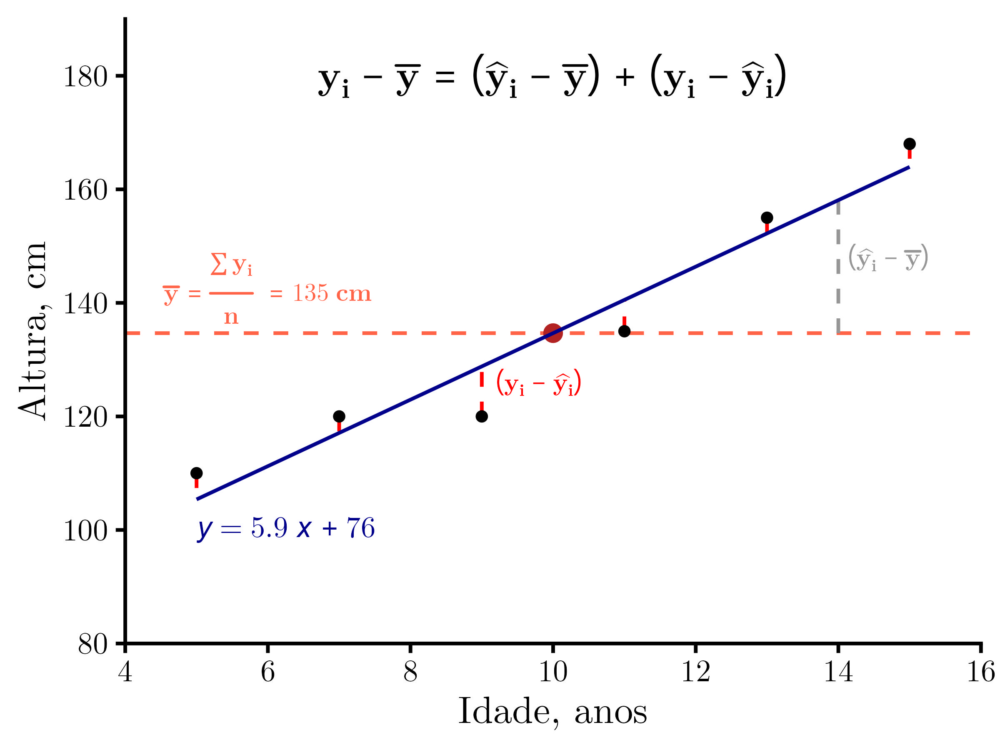{#fig-errosdomodelo}


Podemos elevar tudo ao quadrado e somar, obtendo assim a soma de quadrados. Essa também pode ser particionada, conforme a @eq-sqt. Assim teremos a soma de quadrados total $(SQT = \sum_{i=1}^{n}(y_i - \bar{y})^2)$, a soma de quadrados do modelo $(SQM =\sum_{i=1}^{n}(\hat{y}_i - \bar{y})^2)$ e a soma de quadrados do erro $(SQR= \sum_{i=1}^{n}(y_i - \hat{y})^2)$.

$$
\sum_{i=1}^{n}(y_i - \bar{y})^2=\sum_{i=1}^{n}(\hat{y}_i - 
\bar{y})^2+\sum_{i=1}^{n}(y_i - \hat{y})^2
$${#eq-sqt}


### Coeficiente de determinação $(R^2)$

Essa métrica é basicamente uma medida do efeito de $x$ em reduzir a variabilidade de $y$. Pode ser obtida como na @eq-rdois, que é a soma de quadrados do resíduo dividida pela soma de quadrados total.

$$
R^2 = 1 - \frac{\sum (y_i - {\color{blue}{\hat{y}_i}})^2}
{\sum (y_i - {\color{red}{\bar{y}}})^2} = 1 - \frac{{\color{blue}{SQR}}}{{\color{red}{SQT}}}
$${#eq-rdois}

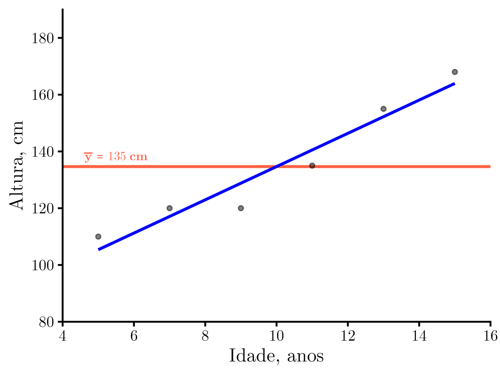

O $R^2$ varia entre $0$ e $1$. O valor de $0$ é encontrado quando não existe relação linear entre $x$ e $y$, ou seja, a variável $x$ não explica nada da variação de $y$ e a média de $y$ poderia ser utilizada como estimativa do valor mais provável. Já o valor de $1$ é encontrado quando $x$ explica toda a variação de $y$. Nesse caso, é possível dizer que mudanças no valor de $x$ também têm efeito no valor de $y$. Essa "força" pode ser observada na @fig-rdoisanima.

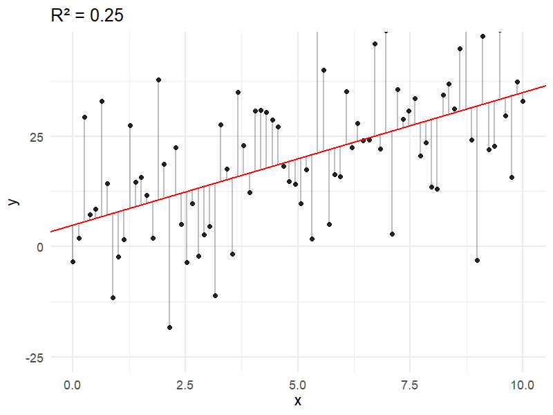{#fig-rdoisanima}

### Coeficiente de determinação $(R^2)$ do exemplo

Agora, vou aplicar as equações para determinar o coeficiente de determinação do modelo de regressão entre a idade e a altura.

Primeiro, para calcular o numerador é necessário substituir os valores de $x$ na equação para obter os valores de $\hat{y}$.

$$
\hat{y}_i= 76.09 + 5.86 * x_i
$$

$$
\hat{{y}} =
\begin{bmatrix}
\hat{y}_1 \\
\hat{y}_2 \\
\hat{y}_3 \\
\hat{y}_4 \\
\hat{y}_5 \\
\hat{y}_6
\end{bmatrix}
=
\begin{bmatrix}
105.38 \\
117.10 \\
128.81 \\
140.52 \\
152.24 \\
163.95
\end{bmatrix}
$${#eq-ychapel}

Agora, podemos fazer o cálculo do denominador, ou seja, a soma de quadrados do erro.

$$
\begin{aligned}
\sum (y_i - \hat{y}_i)^2
= \;& (110-105.38)^2 + (120-117.10)^2 + (120-128.81)^2 \\
& + (135-140.52)^2 + (155-152.24)^2 + (168-163.95)^2
\end{aligned}
$$

$$
\sum (y_i - \hat{y}_i)^2= 161.90
$$

Já para o numerador é mais simples, uma vez que se utiliza a média.

$$
\begin{aligned}
\sum (y_i - \bar{y})^2
= \;& (110-134.67)^2 + (120-134.67)^2 + (120-134.67)^2 \\
& + (135-134.67)^2 + (155-134.67)^2 + (168-134.67)^2
\end{aligned}
$$

$$
\sum(y_i - \bar{y})^2 = 2563.33
$$

Por fim, o $R^2$ é encontrado.

$$
R^2= 1 - \frac{161.90}{2563.33} = 0.94
$$

### Teste $F$

Outra forma de verificar a variância é por meio do teste F ou análise da variância (ANOVA). A @tbl-anova apresenta o teste F e o p-valor para o modelo. Aqui não cabem as explicações para os cálculos da ANOVA, embora boa parte seja feita na regressão.

Como resultado principal temos que o p-valor é menor que 0.05, indicando que o modelo é significativo. Portanto, temos evidência de que o modelo é melhor que a média para explicar a variação de $y$.

```{r}
#| label: tbl-anova
#| tbl-cap: ANOVA para a regressão linear do exemplo

library(tidyverse)
library(gt)
library(broom)

# =========================================================
# Dados
# =========================================================

# =========================================================
# Modelo de regressão
# =========================================================

modelo <- lm(y ~ x, data = dados)

# =========================================================
# Tabela ANOVA
# =========================================================

anova_tab <- anova(modelo)
# summary(aov(y ~ x, data = dados))
# Extraindo valores
SQ_reg <- anova_tab$`Sum Sq`[1]
SQ_res <- anova_tab$`Sum Sq`[2]
SQ_tot <- SQ_reg + SQ_res

df_reg <- anova_tab$Df[1]
df_res <- anova_tab$Df[2]
df_tot <- df_reg + df_res

QM_reg <- anova_tab$`Mean Sq`[1]
QM_res <- anova_tab$`Mean Sq`[2]

F_calc <- anova_tab$`F value`[1]
p_valor <- anova_tab$`Pr(>F)`[1]

# =========================================================
# Construindo tabela
# =========================================================

tabela_anova <- tibble(
  Fonte = c("Regressão (x)", "Resíduo", "Total"),

  `Graus de liberdade` = c(
    paste0(df_reg, " (p-1)"),
    paste0(df_res, " (n-p)"),
    paste0(df_tot, " (n-1)")
  ),

  `Soma dos quadrados (SQ)` = c(
    paste0("SQT - SQR = ", round(SQ_reg, 2)),
    round(SQ_res, 2),
    round(SQ_tot, 2)
  ),

  `Quadrado médio` = c(
    round(QM_reg, 2),
    round(QM_res, 2),
    ""
  ),

  `Razão F` = c(
    paste0(round(F_calc, 2), " (p = ", format.pval(p_valor, digits = 3), ")"),
    "",
    ""
  )
)

# =========================================================
# Tabela GT
# =========================================================

tabela_anova |>
  gt() |>

  tab_header(
    title = "Tabela ANOVA - Teste F"
  ) |>

  cols_label(
    Fonte = "Fonte de variação",
    `Graus de liberdade` = html("Graus de liberdade <br> (df)"),
    `Soma dos quadrados (SQ)` = html("Soma dos quadrados <br> (SQ)"),
    `Quadrado médio` = html("Quadrado médio <br> QM = SQ/df"),
    `Razão F` = "valor de F e p-valor"
  ) |>

  cols_align(
    align = "center"
  ) |>

  tab_options(
    table.border.bottom.color = "black",
    heading.align = "center"
  )
```


## Significância dos $\beta$s do modelo

Como a variável dependente $(y)$ segue uma distribuição normal e as estimativas para $\beta_0$ e $\beta_1$ são obtidas por meio de uma função linear de $y$, por consequência os coeficientes do modelo também possuem uma distribuição do tipo normal. Isso pode ser observado nas @eq-distbeta0 e @eq-distbeta1. Isso significa que, embora tenhamos as estimativas para a melhor reta, poderíamos ter infinitas retas passando entre os dados.

::: {.columns}

::: {.column}

$$
\beta_0 \sim N(\beta_0, \sigma^2_{\beta_0})
$${#eq-distbeta0}

:::

::: {.column}

$$
\beta_1 \sim N(\beta_1, \sigma^2_{\beta_1})
$${#eq-distbeta1}

:::

:::

É possível simular o que seria isso. Partindo dos resultados da @eq-regfinal, utilizo os valores de $\beta$s para simular 1 mil retas de regressão mudando apenas o erro. Sabemos que em uma regressão linear os erros devem ser normais com média zero e um desvio padrão. Com isso, adiciono erros de forma pseudoaleatória na equação: $y_{i} = 76.09 + 5.86x_{i} + \epsilon_{i}$ e obtenho assim novas estimativas para $y$. Agora, posso utilizar esse novo $\hat{y}$ e realizar uma regressão com os valores de $x$, calculando assim novas estimativas de $\beta_{0}$ e $\beta_{1}$.

As animações abaixo mostram os resultados das simulações. Na imagem superior esquerda temos cada uma das 1000 linhas representando a reta de regressão calculada. Já na direita e na figura inferior da esquerda temos as distribuições de $\beta_0$ e $\beta_1$, respectivamente. A linha sólida em preto é a distribuição teórica que cada estimador deveria assumir, já as barras representam os valores calculados por meio da simulação. Observamos que, de fato, as distribuições se assemelham a uma curva tipo sino e, portanto, assume-se que são "normais".

::: {layout-nrow=2}

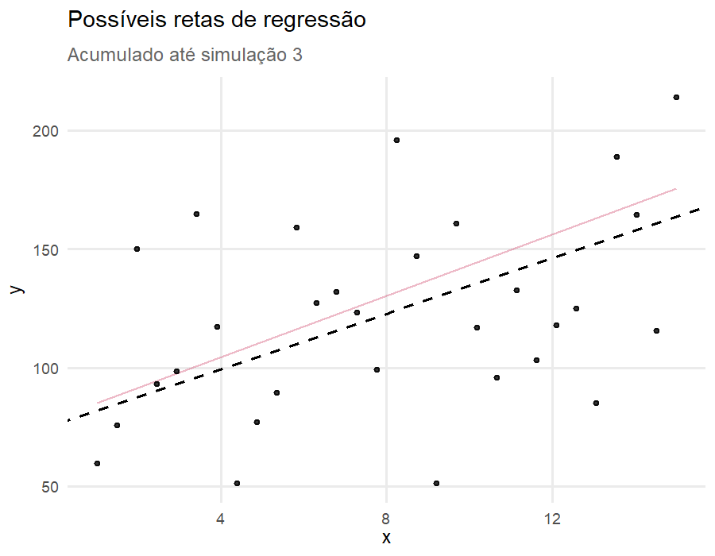

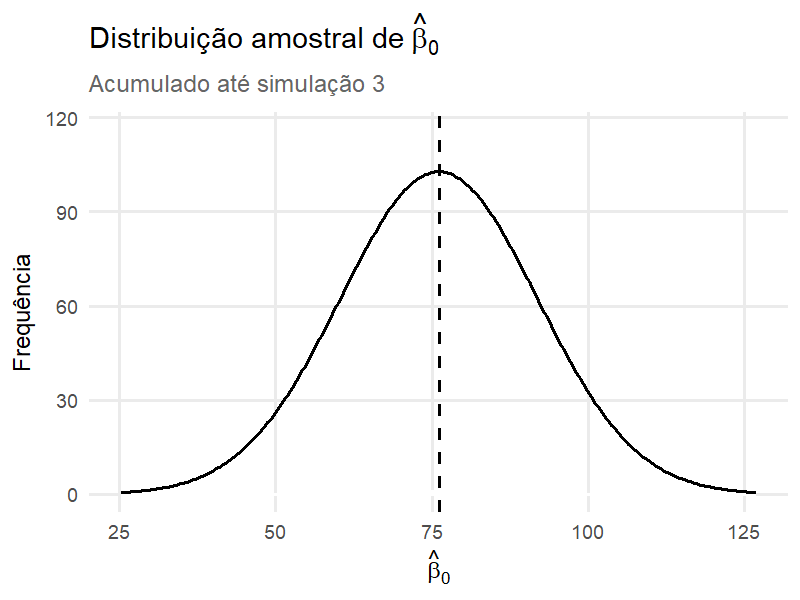


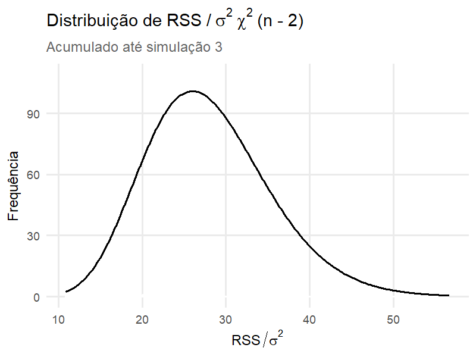

:::

Outra importante constatação é que a soma dos resíduos ao quadrado (em inglês RSS: residual sum of squares) dividida pela variância ($\sigma^2$) dos erros assume uma distribuição do tipo chi-quadrado com graus de liberdade de $n-p$, onde $n$ é número de amostras e $p$ o número de parâmetros do modelo. Para uma regressão linear simples será sempre $n-2$, pois sempre há 2 parâmetros (intercepto e coeficiente angular). A distribuição dos resíduos ao quadrado pode ser observada na figura inferior da direita.

A partir do conhecimento de que os estimadores ($\beta$) possuem distribuição de probabilidade é possível realizar testes de hipóteses sobre suas estimativas. Boa parte do que torna valiosa a regressão é o teste de hipótese dos coeficientes do modelo.

### Teste de significância para $\beta_0$ e $\beta_1$ 

Talvez o teste de hipótese mais importante de uma regressão seja em relação ao coeficiente angular ou $\beta_1$, que é o que responde à pergunta sobre se $x$ explica $y$. Caso $\beta_1$ não seja diferente de $0$, temos uma linha reta, onde a média de $y$ é suficiente para explicar sua variação e a variável $x$ é inútil.

Essa hipótese pode ser testada considerando:

$H_0 : \beta_1 = 0$

$H_1 : \beta_1 \ne   0$

A hipótese nula $(H_0)$, ou a suposição inicial, é a de que $\beta_1$ não possui valor diferente de 0; já a alternativa $(H_1)$ é a de que o valor de $\beta_1$ é diferente de 0.

Para calcular isso, utiliza-se a estatística $t$ na forma representada pela @eq-betat. Temos a diferença entre o $\beta_1$ estimado e o considerado como verdadeiro, dividida pelo desvio padrão do $\beta_1$. Assume-se que essa razão possui uma distribuição do tipo $t$ de Student, logo queremos calcular uma estatística $t$. 

$$
t = \frac{\hat{\beta_1}-\beta_1}{SE(\hat{\beta}_1)} \sim t(N-2) 
$${#eq-betat}

Mas utilizar a distribuição $t$, pelo menos para mim, foi algo que levou tempo até entender. Mas agora sim, na @fig-tnormchi é possível observar o que acontece quando se divide uma distribuição Normal por uma chi-quadrado... Justamente... uma distribuição T. Isso é representado de forma indireta na @eq-betat.

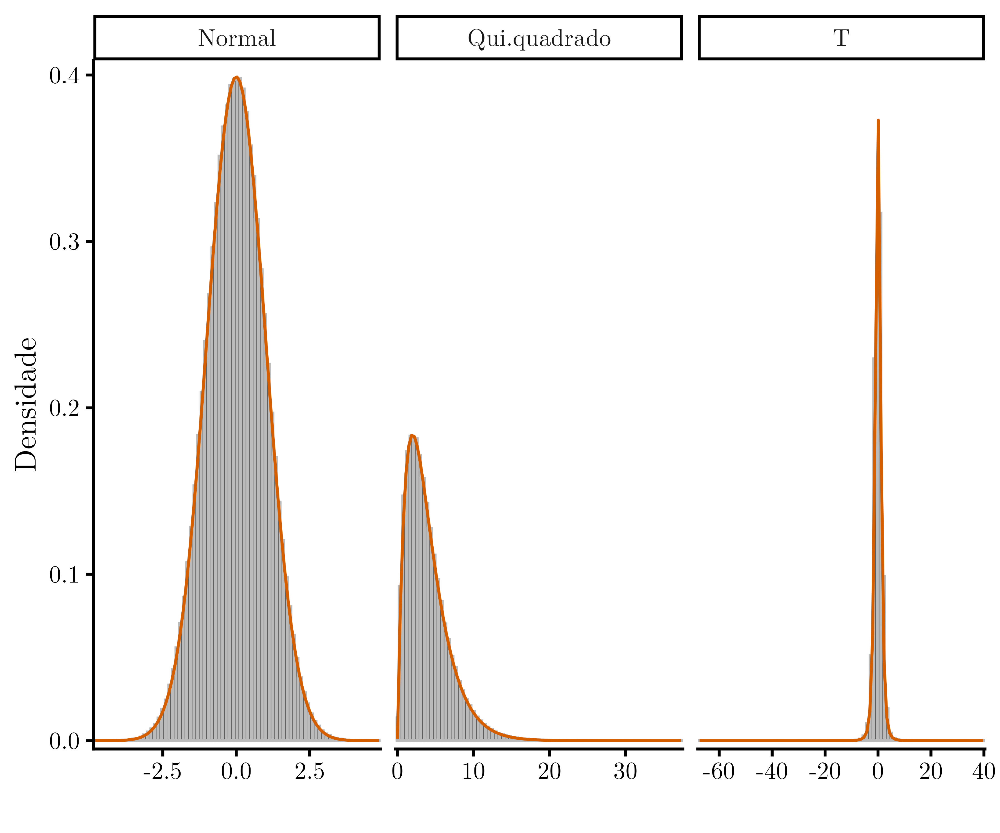{#fig-tnormchi}


O $SE(\hat{\beta}_1)$ é o erro padrão do $\beta_1$ e pode ser escrito também como: $SE(\hat{\beta}_1) = \sqrt{\frac{EQM}{\sum(x_1 - \bar{x})^2}}$, onde $EQM$ é o erro quadrático médio. Esse foi calculado na ANOVA (@tbl-anova), mas basicamente se obtém como:

$$EQM = \frac{SQR}{(n-p)}$$

Já para o $\beta_0$ é um pouco mais complexo e utiliza a equação:

$$ 
t = \frac{\hat{\beta_0}-\beta_0}{\sqrt{EQM*(\frac{(\frac{1}{n})+(\bar{x}^2)}{\sum(x_1 - \bar{x})^2})}} \sim t(N-2) 
$${#eq-distbeta02}

### Teste de significância para $\beta_0$ e $\beta_1$ do problema

Como já descrito acima, o valor encontrado de $\beta_0$ do modelo foi de $76.10$ e $\beta_1$ de $5.86$.

Primeiro para o $\beta_1$: se lembrarmos, a expressão $\sum(x_1 - \bar{x})^2$ já foi calculada como denominador para encontrar o $\beta_1$ na @eq-beta1, onde obtivemos o valor de $70$. Já o $EQM$ é dado por: 

$$
EQM = \frac{161.90}{(6-2)}=40.48
$${#eq-eqmbeta1}

Logo:

$$
SE(\hat{\beta}_1) = \sqrt{\frac{70.48}{70}}  = 0.7604
$$

Já para encontrar o valor da estatística $t$ para o $\beta_1$, calcula-se:

$$
t = \frac{5.86-0}{0.7604} = 7.703
$${#eq-tobs}

Agora, basta verificar na distribuição $t$ qual a probabilidade de observar um valor de 7.7 ou mais extremo, e se esse valor está dentro da probabilidade de 5%, que é o nível alfa usual.

Na @fig-disttbeta1 é plotada a distribuição $t$ com o valor crítico de $t_c$ para um nível de significância de 5% ou 0.05. O $t_c$ diz respeito ao valor na curva $t$ que limita nosso nível de significância, ou seja, para podermos dizer que algo foi significativo a 5% nessa curva, temos que obrigatoriamente observar um valor mais extremo que $\pm 2.78$.

Como valor de $t$ observado ($t_{obs}$), temos o valor encontrado na @eq-tobs, que foi de $7.7$, ou seja, o valor de $t_{obs}$ é maior que o $t_c$, portanto significativo a 5% de probabilidade de erro.

Também podemos dizer que a probabilidade de encontrar um valor de $t$ igual ao observado é de 0.153% ($p=0.00153$), ou ainda que, dentro de todos os possíveis valores de $t$ que podemos encontrar, o observado é pouco provável.

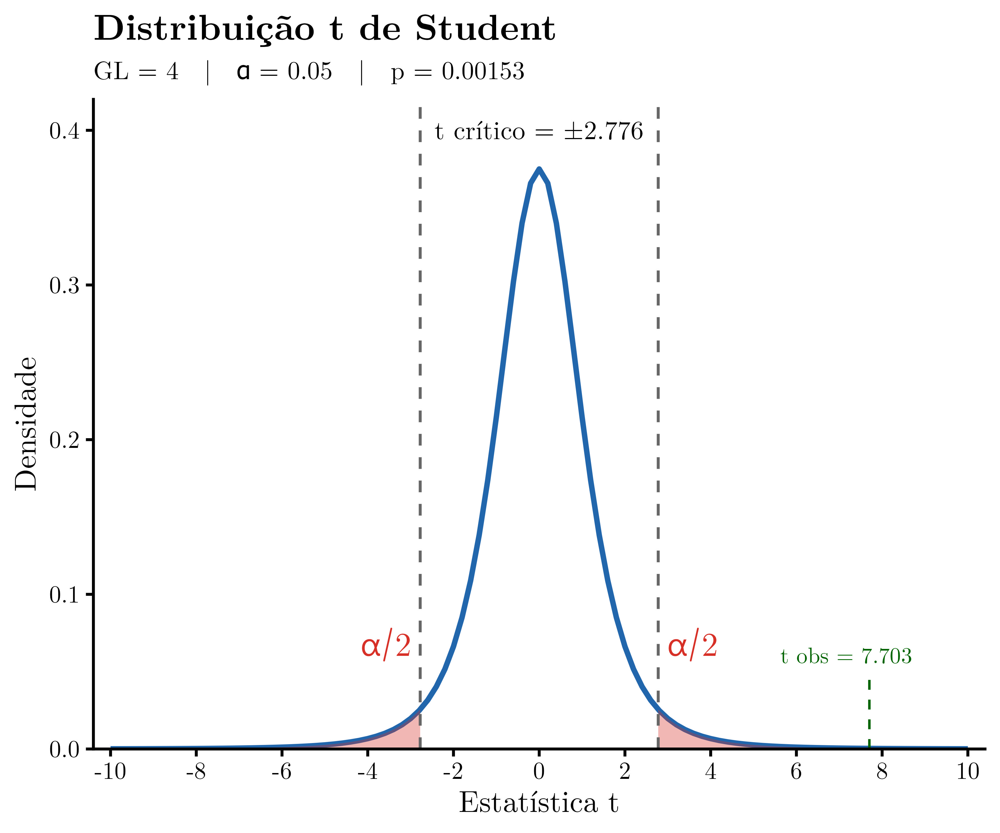{#fig-disttbeta1}

Para o $\beta_0$, utiliza-se a @eq-distbeta02, mas primeiro vamos calcular o $SE(\hat{\beta}_0)$, conforme:

$$
SE(\hat{\beta}_0) = \sqrt{40.48*(\frac{(\frac{1}{6})+(10^2)}{70})} = 8.035 
$$

Com isso, agora calculamos o $t_{obs}$ para o $\beta_0$, como:

$$ 
t = \frac{76.10-0}{8.035} = 9.47 
$$

E, da mesma forma que para o $\beta_1$, podemos visualizar a distribuição e a significância estatística (@fig-disttbeta0). Também observamos um valor de $t_{obs}$ mais extremo que o $t_c$ ($9.47>2.776$), portanto afirmamos que para 5% de probabilidade de erro há diferença significativa.

{#fig-disttbeta0}

### Intervalo de confiança do beta e da predição (IC)

Podemos calcular os limites onde os verdadeiros valores dos $\beta$s serão encontrados para uma determinada probabilidade: o intervalo de confiança.

O intervalo de confiança pode ser interpretado da seguinte forma: se o experimento fosse repetido indefinidamente, e em cada repetição fosse construído um intervalo de confiança pelo mesmo procedimento, aproximadamente 95% desses intervalos conteriam o verdadeiro valor do parâmetro. Após a coleta dos dados e a construção de um intervalo específico, não é correto afirmar que há 95% de probabilidade de o parâmetro estar dentro desse intervalo.

Para o $\beta_1$ é utilizada a equação:

$$
\hat{\beta}_1
-
t_{\alpha/2,\;n-2}
\,SE\!\left(\hat{\beta}_1\right)
\leq
\beta_1
\leq
\hat{\beta}_1
+
t_{\alpha/2,\;n-2}
\,SE\!\left(\hat{\beta}_1\right)
$$

Já para o $\beta_0$ é:

$$
\hat{\beta}_0
-
t_{\alpha/2,\;n-2}
\,SE\!\left(\hat{\beta}_0\right)
\leq
\beta_0
\leq
\hat{\beta}_0
+
t_{\alpha/2,\;n-2}
\,SE\!\left(\hat{\beta}_0\right)
$$

Mas, de forma resumida, o IC nada mais é que um parâmetro (nesse caso o valor de $t_c$) que multiplica uma medida de incerteza (nesse caso o erro padrão, $SE$). Assim temos que:

$CI = t_c* SE(\hat{\beta}_1)$ e $CI = t_c* SE(\hat{\beta}_0)$

E para encontrar essa amplitude de IC, basta somar e subtrair do valor de $\hat{\beta_1}~ou~\hat{\beta_0}$

$\beta_1~\pm{CI}$ e $\beta_0~\pm{CI}$

### Intervalo de confiança do beta do modelo

Para o $\beta_1$ temos:

$\hat{\beta_1}= 5.86$

$SE(\hat{\beta_1})=0.7604$

$t_c = 7.703$

E o IC vai ser:

$$ 
5.86 - (2.776 * 0.7604) \leq \beta_1 \leq 5.86 + (2.776 * 0.7604) 
$$

$$
3.74913 \leq \beta_1 \leq 7.97087
$$

Ou, 

$$
\beta_1 = 5.86 \pm{2.11087}
$$

Para o $\beta_0$ será a mesma coisa:

$\hat{\beta_0}= 76.1$

$SE(\hat{\beta_0})=8.035$

$t_c = 9.47$

E o IC vai ser:

$$ 
76.1- (2.776 * 8.035) \leq \beta_0 \leq 76.1 + (2.776 * 8.035) 
$$

$$
53.79484\leq \beta_0 \leq 98.40516
$$

Ou, 

$$
\beta_0 = 76.1 \pm{22.30516}
$$

### Intervalo de confiança para resposta média

Podemos também calcular "bandas" de confiança para a reta de regressão e os valores médios por todo o domínio de $x$.

Para isso vamos usar a @eq-icmedia e o melhor... quase tudo já foi calculado. A única "entrada" agora será com valores de $x$ que podem ser novos e é dado por $x_0$, mas uso os mesmos.
 
$$
\hat{y}(x_0)
\pm
t_{\alpha/2,\;n-2}
\sqrt{
EQM
\left(
\frac{1}{n}
+
\frac{(x_0-\bar{x})^2}
{\sum_{i=1}^{n}(x_i-\bar{x})^2}
\right)
}
$${#eq-icmedia}

### Intervalo de confiança para resposta média do modelo

Como vou utilizar os mesmos valores de $x$, os valores de $\hat{y}$ já foram calculados em @eq-ychapel. Também temos os desvios de $x$ em @eq-somadesviox, bem como o somatório, o $t$ crítico em @fig-disttbeta1 e o $EQM$ em @eq-eqmbeta1. Os valores que vão mudar serão o $\hat{y}$ e o desvio de $x$ (@eq-yychap e @eq-desvioxx); isso é denotado na equação geral do IC com o índice $i$.

$$\hat{y}(x_0)_i = \begin{bmatrix}
105.38\\
117.10\\
128.81\\
140.52\\
152.24\\
163.95
\end{bmatrix}
$${#eq-yychap}

$$
(x_0-\bar{x})^2_i= \begin{bmatrix}
25\\
9\\
1\\
1\\
9\\
25
\end{bmatrix}
$${#eq-desvioxx}

$$
\begin{aligned}
IC_{inf}=
\hat{y}(x_0)_i
-
(2.776*
\sqrt{
40.48
\left(
\frac{1}{6}
+
\frac{
(x_0-\bar{x})^2_i
}{70}
\right))
}
&=
\begin{bmatrix}
92.599\\
107.499\\
121.297\\
133.011\\
142.642\\
151.170
\end{bmatrix}
\end{aligned}
$$

e

$$
\begin{aligned}
IC_{sup}=
\hat{y}(x_0)_i
+
(2.776*
\sqrt{
40.48
\left(
\frac{1}{6}
+
\frac{
(x_0-\bar{x})^2_i
}{70}
\right))
}
&=
\begin{bmatrix}
118.163\\
126.692\\
136.322\\
148.037\\
161.834\\
176.735
\end{bmatrix}
\end{aligned}
$$

Por fim, podemos plotar esses pontos e gerar as "bandas" ou a região de confiança (@fig-bandaconfi).

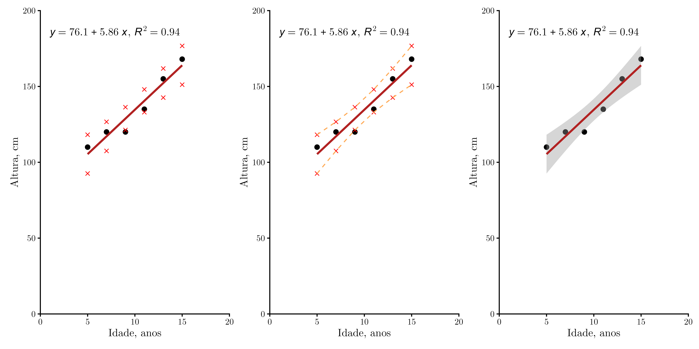{#fig-bandaconfi}

## Resultado final da análise

Agora, podemos descrever o resultado da análise em forma de texto, o que pode ser usado para descrever qualquer regressão.

Exemplo de descrição de resultado:

Para verificar o efeito da idade (variável independente) sobre a altura (variável dependente) foi realizada uma análise de regressão linear simples. O modelo teórico é dado por: $Altura = \beta_{0} + \beta_{1} Idade + \epsilon$.

O modelo é estatisticamente significativo e explica uma parte substancial da variância ($R^2=0.94,~F(1,4) = 59.33,~p = 0.0015$). O efeito da idade foi significativo e positivo: a cada aumento de uma unidade na idade, a altura aumenta, em média, 5.86 cm ($CI [3.75,7.97],~t(4) = 7.70,~p = 0.0015$).

Sobre o intercepto, temos que ter cuidado. Nosso modelo diz que, para uma pessoa com idade igual a zero, a sua altura é de 76.1 cm ($CI[53.79,98.41],~t(4)=9.47,~p=0.0007$). A interpretação, nesse caso, deve ser baseada na área de conhecimento; neste exemplo, a menos que tenhamos um gigante, essa interpretação não faz sentido, já que, biologicamente, até onde sei, ao nascer (idade zero) as pessoas têm comprimento abaixo desse valor.

E isso tudo é resumido na @fig-finalpronto.

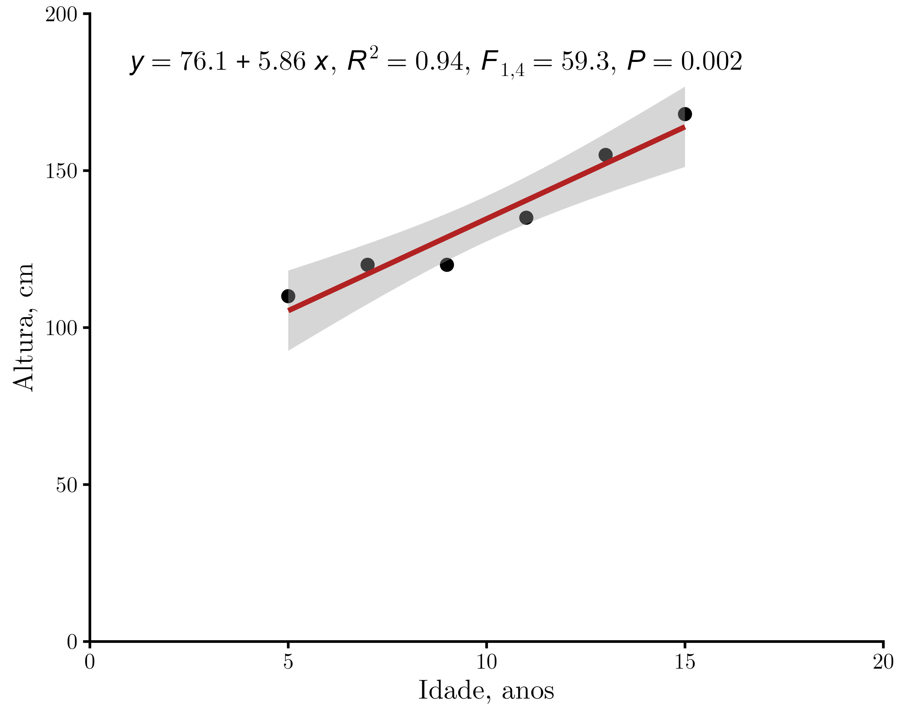{#fig-finalpronto}

Então quer dizer que a idade ocasiona o aumento da altura? Ou seja, ficar velho te deixa alto?

# Regressão linear simples define causa? (bônus)

Bem, a resposta para a pergunta sobre causa é complicada. Por definição, a regressão linear **não** expressa causa. Em um modelo de regressão significativo, o que temos é que a variável $y$ possui associação com a variável $x$, mas não que $x$ é o responsável por causar $y$. Parece confuso, mas faz todo sentido. Isso acontece porque não temos acesso a todas as variáveis que podem estar interferindo no fenômeno e, portanto, nas observações. Dentre muitas formas de definir causa, podemos dizer que a causa possui 3 componentes: 1) direcionalidade, 2) temporalidade e 3) reprodutibilidade. Esses componentes são fundamentais para estabelecer uma relação causal, algo que a regressão linear simples não pode garantir, por si só.

Isso não significa que a regressão não é importante, apenas que devemos ter cuidado ao dizer que as mudanças observadas na variável dependente são **causadas** pela variável independente.

Na @fig-dag há exemplos de algumas relações que podem ser encontradas. Como podemos observar, a regressão linear corresponde ao subgráfico com a relação direta. Porém, não há como saber se as demais relações estão ocorrendo. Por exemplo, poderíamos ter em nossa relação direta um confundidor, que é uma variável com efeito tanto em $x$ quanto em $y$ e que, portanto, leva à observação da relação entre $x$ e $y$ pelo modelo. Essa pode ser uma das explicações para as correlações espúrias. Também podemos ter uma variável mediadora, ou seja, responsável por mediar uma parte da variação entre $x$ e $y$, além da variação direta. E, por fim, temos a moderação, em que outra variável pode estar moderando a relação entre $x$ e $y$. Em todos os casos, se estamos usando apenas uma regressão linear simples, podemos estar suscetíveis a não observar essa variável oculta. Por isso: regressão não implica causa.

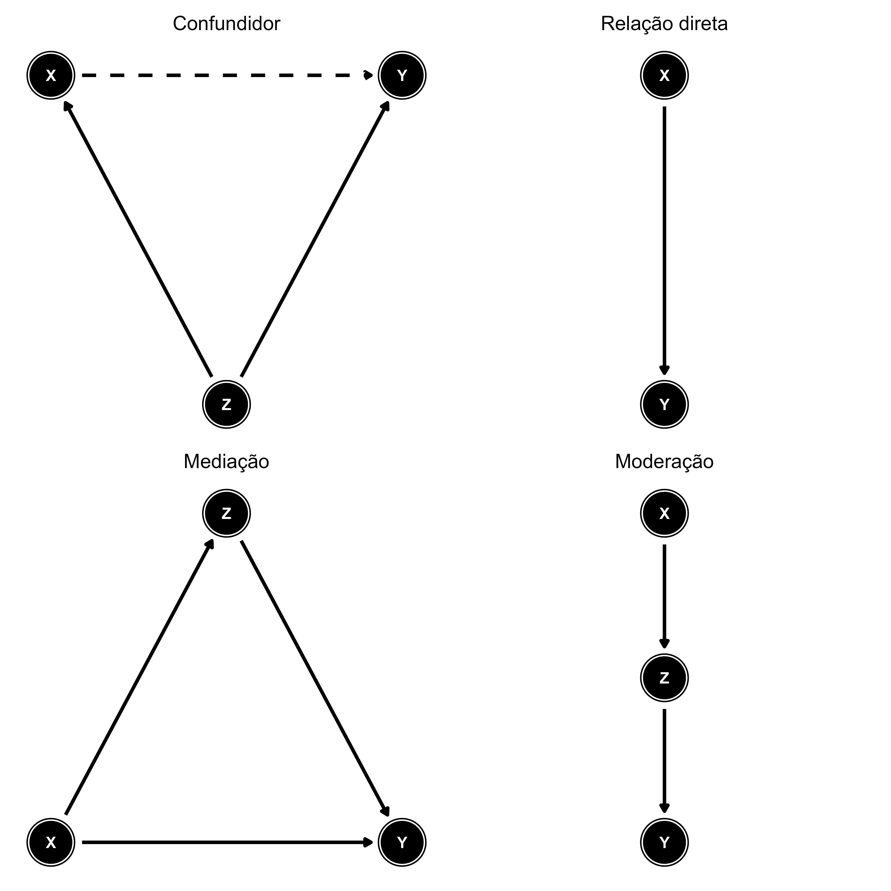{#fig-dag}

Ainda assim, com os avanços dos estudos, essas variáveis ocultas podem ir sendo descobertas e aprimorando a nossa teoria... Incrível!


::: {.callout-important collapse="true" title="Ajuda estatística"}

Boa parte dos cálculos e das dúvidas foi resolvida graças à ajuda de Diogo Bolzan (um quase estatístico da UFRGS).

:::

